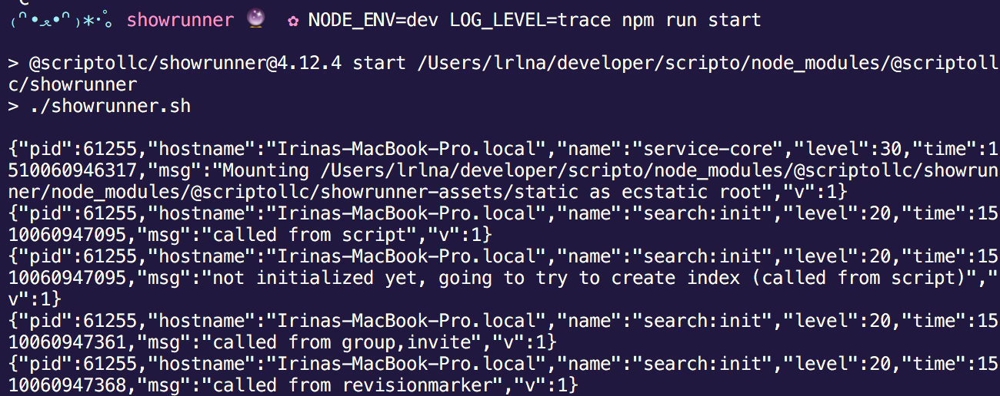
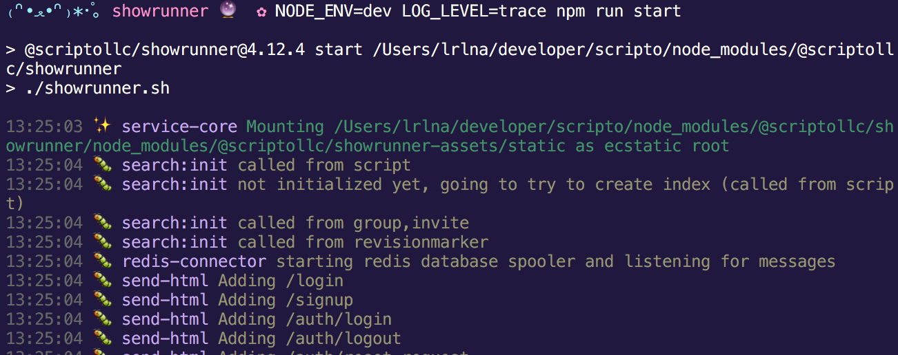

# Logging

Logging in your backend applications provides a good way to gather inforamtion
on what could be happening in a given request lifetime. We personally are big
fans of [pino](https://github.com/pinojs/pino), and want you to also build it
into your current application. 

Before doing this portion of the workshop, it'd be best if you finished either
the [merry](/merrryyyy) or the [http](/simple-http) part so you can add on to
it. Otherwise, you can hook it up to an existing server application you already
have going ✨.

There are a few possible levels you can use in your application:

1. __debug__: you should use this for development purposes.
2. __info__: use this when you need to log out a "transaction" message, i.e.
   `log.info('Connected to redis')`
3. __warn__: use when the error was expected
4. __error__: use when the error was unexpected
5. __fatal__: use for system or crytical errors that terminate processes 
6. __trace__: use for a more detailed view in production; ideally your config
   should be able to turn these off, as `LOG_LEVEL=trace` ends up being quite
   noisy. 

## Exercise

Go back to your existing application. Pick either the `merry`, or the `http`
version, and log out the important events following the breakdown above. If
you're using [merry](github.com/shipharbor/merry), you're already hooked into
`pino`, so you will be able to log with `ctx.log`. Otherwise, you're going to
need to require:

```js
var pino = require('pino')

var log = pino({ name: 'namespaced:module-name', level: info })
log.info('Initial log')
```

When you're building out your application in development, pino will write to
`stdout`, so you end up with something like this.



For the humans in the crowd (sry computers), setup up
[pino-colada](github.com/lrlna/pino-colada). If you're using merry, you will
already have it. Otherwise just install and add to your `package.json` `npm
start` command:

```sh
node ./ | pino-colada
```



###  Notes
In larger applications, you're likely to have different log levels in
development, staging and production. A neat pattern we've been following is
creating a module-wide log file that you can use for regular logging and to
spin up child processes. It essentially sets up the same as above, but also
takes into account your `env` variables. Something like this:

```js
var pino = require('pino')

var levels = [ 'silent', 'trace', 'debug', 'info', 'warn', 'error', 'fatal' ]

module.exports = pino({
  name: 'namespaced:module-name',
  level: levels.includes(process.env.LOG_LEVEL) ? process.env.LOG_LEVEL : 'info'
})
```

## See Also:
- https://github.com/lrlna/pino-colada
- https://github.com/pinojs/pino
- https://github.com/shipharbor/merry
